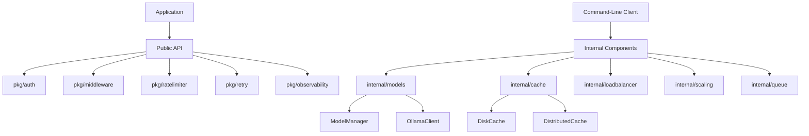

# Gollama Documentation

Gollama is a comprehensive Go library that provides essential components for building scalable, high-performance applications with Ollama integration. It offers modular packages for authentication, rate limiting, observability, caching, load balancing, and more, designed to be used independently or together.

## Table of Contents

- [Overview](#overview)
- [Installation](#installation)
- [Architecture](#architecture)
- [Public API Packages](#public-api-packages)
  - [Authentication (`pkg/auth`)](#authentication-pkgauth)
  - [Middleware (`pkg/middleware`)](#middleware-pkgmiddleware)
  - [Rate Limiting (`pkg/ratelimiter`)](#rate-limiting-pkgratelimiter)
  - [Retry Logic (`pkg/retry`)](#retry-logic-pkgretry)
  - [Observability (`pkg/observability`)](#observability-pkgobservability)
- [Internal Components](#internal-components)
  - [Model Management (`internal/models`)](#model-management-internalmodels)
  - [Caching (`internal/cache`)](#caching-internalcache)
  - [Load Balancing (`internal/loadbalancer`)](#load-balancing-internalloadbalancer)
  - [Autoscaling (`internal/scaling`)](#autoscaling-internalscaling)
  - [Job Queue (`internal/queue`)](#job-queue-internalqueue)
  - [Configuration (`config`)](#configuration-config)
- [Command-Line Client](#command-line-client)
- [Examples](#examples)
- [Contributing](#contributing)
- [License](#license)

## Overview

Gollama started as an application but has been refactored into a modular library to make its powerful components available for use in any Go project. Each package follows Go best practices, is well-documented, and includes comprehensive examples.

### Core Features

- **Modular Design**: Use only the components you need
- **Well-Documented API**: Comprehensive documentation and examples
- **Production-Ready**: Designed for reliability and performance
- **Semantic Versioning**: Clear compatibility guarantees
- **Minimal Dependencies**: Each package has only the dependencies it needs

## Installation

To use Gollama in your project, install it using Go modules:

```bash
go get github.com/h2co32/gollama
```

Or add it to your `go.mod` file:

```
require github.com/h2co32/gollama v1.0.0
```

Then import only the packages you need:

```go
import (
    "github.com/h2co32/gollama/pkg/auth"
    "github.com/h2co32/gollama/pkg/retry"
    // Import other packages as needed
)
```

## Architecture

Gollama follows a modular architecture with clear separation between public API packages and internal components.



## Public API Packages

### Authentication (`pkg/auth`)

The `auth` package provides utilities for JWT and HMAC authentication.

#### Usage

```go
import "github.com/h2co32/gollama/pkg/auth"

// Generate a JWT token
claims := map[string]interface{}{"user_id": 123, "role": "admin"}
token, err := auth.GenerateJWT("your-secret-key", claims)

// Validate a JWT token
claims, err := auth.ValidateJWT("your-secret-key", token)

// Generate an HMAC signature
signature := auth.GenerateHMAC("your-hmac-key", "data-to-sign")
```

### Middleware (`pkg/middleware`)

The `middleware` package provides HTTP middleware components for authentication and other cross-cutting concerns.

#### Usage

```go
import "github.com/h2co32/gollama/pkg/middleware"

// Create a new auth middleware for JWT authentication
authMiddleware := middleware.NewAuthMiddleware(middleware.AuthOptions{
    AuthType:   middleware.AuthTypeJWT,
    JWTSecret:  "your-jwt-secret",
    HMACSecret: "your-hmac-secret",
})

// Use the middleware with an HTTP handler
http.Handle("/protected", authMiddleware.Middleware(http.HandlerFunc(protectedHandler)))

// Get user claims from the request context
func protectedHandler(w http.ResponseWriter, r *http.Request) {
    claims, ok := middleware.GetUserFromContext(r.Context())
    if !ok {
        http.Error(w, "Unauthorized", http.StatusUnauthorized)
        return
    }
    // Use claims...
}
```

### Rate Limiting (`pkg/ratelimiter`)

The `ratelimiter` package provides a token bucket rate limiter for controlling request rates.

#### Usage

```go
import (
    "context"
    "time"
    "github.com/h2co32/gollama/pkg/ratelimiter"
)

// Create a rate limiter with 10 tokens per second and a burst capacity of 20
limiter := ratelimiter.New(10, time.Second, 20)

// Check if an operation is allowed
if limiter.Allow() {
    // Perform the operation
} else {
    // Operation not allowed, handle accordingly
}

// Or wait until an operation is allowed (with timeout)
ctx, cancel := context.WithTimeout(context.Background(), 5*time.Second)
defer cancel()
if err := limiter.Wait(ctx); err == nil {
    // Perform the operation
}
```

### Retry Logic (`pkg/retry`)

The `retry` package provides a flexible retry mechanism with exponential backoff and jitter.

#### Usage

```go
import (
    "time"
    "github.com/h2co32/gollama/pkg/retry"
)

// Configure retry options
opts := retry.Options{
    MaxAttempts:    5,
    InitialBackoff: 100 * time.Millisecond,
    MaxBackoff:     10 * time.Second,
    Jitter:         true,
}

// Execute an operation with retry
err := retry.Do(opts, func() error {
    return makeNetworkRequest()
})
```

### Observability (`pkg/observability`)

The `observability` package provides tools for distributed tracing with OpenTelemetry.

#### Usage

```go
import (
    "context"
    "log"
    "github.com/h2co32/gollama/pkg/observability"
    "go.opentelemetry.io/otel/attribute"
)

// Initialize a tracer provider
tp, err := observability.NewTracerProvider("my-service", "http://localhost:4318")
if err != nil {
    log.Fatalf("Failed to initialize tracer: %v", err)
}
defer tp.Shutdown(context.Background())

// Create a span
ctx, span := tp.StartSpan(context.Background(), "my-operation")
defer span.End()

// Add attributes to the span
observability.AddSpanAttributes(ctx, attribute.String("key", "value"))
```

## Internal Components

### Model Management (`internal/models`)

The `models` package provides utilities for managing Ollama models, including downloading, loading, unloading, versioning, and fine-tuning.

#### Components

- **OllamaClient**: Client for interacting with Ollama models
- **ModelManager**: Manages model lifecycle, including downloading, loading, and fine-tuning

#### Usage

```go
import "github.com/h2co32/gollama/internal/models"

// Create a new Ollama client
client := models.NewOllamaClient()

// Download a model
err := client.DownloadModel(models.DownloadModelRequest{
    Model:   "llama2",
    Version: "latest",
})

// Preload models for faster inference
client.PreloadModels([]string{"llama2", "mistral"})

// Fine-tune a model
err := client.FineTuneModel(models.ModelFineTuningRequest{
    ModelVersion: "llama2",
    Dataset:      "custom-dataset",
})
```

### Caching (`internal/cache`)

The `cache` package provides disk-based and distributed caching mechanisms.

#### Components

- **DiskCache**: File-based caching on the local filesystem
- **DistributedCache**: Redis-based distributed caching

#### Usage: DiskCache

```go
import (
    "time"
    "github.com/h2co32/gollama/internal/cache"
)

// Create a new disk cache
diskCache, err := cache.NewDiskCache("./cache")
if err != nil {
    log.Fatalf("Failed to create disk cache: %v", err)
}

// Store data in the cache
err = diskCache.Set("key", []byte("value"), 1*time.Hour)

// Retrieve data from the cache
data, err := diskCache.Get("key")

// Delete data from the cache
err = diskCache.Delete("key")

// Clear all cached data
err = diskCache.Clear()
```

#### Usage: DistributedCache

```go
import (
    "time"
    "github.com/h2co32/gollama/internal/cache"
)

// Create a new distributed cache
distributedCache := cache.NewDistributedCache("localhost:6379")

// Store data in the cache
type User struct {
    ID   int    `json:"id"`
    Name string `json:"name"`
}
user := User{ID: 1, Name: "John"}
err := distributedCache.Set("user:1", user, 1*time.Hour)

// Retrieve data from the cache
var retrievedUser User
err := distributedCache.Get("user:1", &retrievedUser)

// Delete data from the cache
err := distributedCache.Delete("user:1")

// Clear all cached data
err := distributedCache.Clear()
```

### Load Balancing (`internal/loadbalancer`)

The `loadbalancer` package provides a load balancer for distributing requests across multiple servers.

#### Usage

```go
import (
    "time"
    "github.com/h2co32/gollama/internal/loadbalancer"
)

// Create a new load balancer
servers := []string{"server1:8080", "server2:8080", "server3:8080"}
lb := loadbalancer.NewLoadBalancer(servers, 10*time.Second, 3)

// Get the next healthy server
server, err := lb.GetHealthyServer()
if err != nil {
    log.Fatalf("No healthy servers available: %v", err)
}

// Use the server for your request
// ...
```

### Autoscaling (`internal/scaling`)

The `scaling` package provides an autoscaler for managing worker pools based on system load.

#### Usage

```go
import (
    "time"
    "github.com/h2co32/gollama/internal/scaling"
)

// Create a new autoscaler
as := autoscaler.NewAutoScaler(
    2,                // Minimum workers
    10,               // Maximum workers
    0.75,             // CPU threshold (75%)
    2*time.Second,    // Scale-up interval
    2*time.Second,    // Scale-down interval
)

// Start the autoscaler
as.Start()
defer as.Stop()

// Your application logic here
// ...
```

### Job Queue (`internal/queue`)

The `queue` package provides a job queue for background processing with worker pools and rate limiting.

#### Usage

```go
import (
    "time"
    "github.com/h2co32/gollama/internal/queue"
)

// Create a new job queue with 5 workers and a rate limit of 100ms between jobs
jq := queue.NewJobQueue(5, 100*time.Millisecond)

// Start the workers
jq.StartWorkers()

// Add jobs to the queue
for i := 0; i < 10; i++ {
    id := i
    jq.AddJob(id, func() error {
        fmt.Printf("Processing job %d\n", id)
        // Job logic here
        return nil
    }, 3) // Retry up to 3 times
}

// Wait for all jobs to complete
jq.Wait()

// Get the results
results := jq.GetResults()
for id, err := range results {
    if err != nil {
        fmt.Printf("Job %d failed: %v\n", id, err)
    } else {
        fmt.Printf("Job %d succeeded\n", id)
    }
}
```

### Configuration (`config`)

The `config` package provides configuration profiles for different environments.

#### Usage

```go
import "github.com/h2co32/gollama/config"

// Use the default configuration profile
profile := config.DefaultProfile

// Or use the production configuration profile
profile := config.ProductionProfile

// Access configuration values
maxRetries := profile.MaxRetries
timeout := profile.Timeout
rateLimit := profile.RateLimit
temperature := profile.ModelSettings["temperature"].(float64)
```

## Command-Line Client

Gollama includes a command-line client for interacting with Ollama models.

### Usage

```bash
# Download a model
gollama -model llama2 -action download

# Preload a model
gollama -model llama2 -action preload

# Fine-tune a model
gollama -model llama2 -action fine-tune

# Display version information
gollama -version
```

## Examples

Each package includes comprehensive examples in the `pkg/examples` directory:

- **Authentication**: JWT and HMAC authentication examples
- **Middleware**: HTTP middleware usage examples
- **Rate Limiting**: Rate limiter usage in various scenarios
- **Retry Logic**: Retry patterns for different use cases
- **Observability**: Tracing examples for HTTP requests and error handling

### Complete Example: Building a Web Service with Gollama

```go
package main

import (
    "context"
    "encoding/json"
    "log"
    "net/http"
    "time"

    "github.com/h2co32/gollama/pkg/auth"
    "github.com/h2co32/gollama/pkg/middleware"
    "github.com/h2co32/gollama/pkg/observability"
    "github.com/h2co32/gollama/pkg/ratelimiter"
    "github.com/h2co32/gollama/pkg/retry"
)

func main() {
    // Initialize tracer
    tp, err := observability.NewTracerProvider("example-service", "http://localhost:4318")
    if err != nil {
        log.Fatalf("Failed to initialize tracer: %v", err)
    }
    defer tp.Shutdown(context.Background())

    // Create rate limiter
    limiter := ratelimiter.New(10, time.Second, 20)

    // Create auth middleware
    authMiddleware := middleware.NewAuthMiddleware(middleware.AuthOptions{
        AuthType:  middleware.AuthTypeJWT,
        JWTSecret: "your-jwt-secret",
    })

    // Define handlers
    http.HandleFunc("/login", func(w http.ResponseWriter, r *http.Request) {
        // Rate limit check
        if !limiter.Allow() {
            http.Error(w, "Rate limit exceeded", http.StatusTooManyRequests)
            return
        }

        // Create a span for this operation
        ctx, span := tp.StartSpan(r.Context(), "login")
        defer span.End()

        // Generate a JWT token
        claims := map[string]interface{}{
            "user_id": 123,
            "role":    "admin",
            "exp":     time.Now().Add(24 * time.Hour).Unix(),
        }
        token, err := auth.GenerateJWT("your-jwt-secret", claims)
        if err != nil {
            http.Error(w, "Failed to generate token", http.StatusInternalServerError)
            return
        }

        // Return the token
        w.Header().Set("Content-Type", "application/json")
        json.NewEncoder(w).Encode(map[string]string{"token": token})
    })

    // Protected endpoint with auth middleware
    http.Handle("/protected", authMiddleware.Middleware(http.HandlerFunc(func(w http.ResponseWriter, r *http.Request) {
        // Get user claims from context
        claims, ok := middleware.GetUserFromContext(r.Context())
        if !ok {
            http.Error(w, "Unauthorized", http.StatusUnauthorized)
            return
        }

        // Create a span for this operation
        ctx, span := tp.StartSpan(r.Context(), "protected-endpoint")
        defer span.End()

        // Use retry for external API call
        var result string
        err := retry.Do(retry.Options{
            MaxAttempts:    3,
            InitialBackoff: 100 * time.Millisecond,
            MaxBackoff:     1 * time.Second,
            Jitter:         true,
        }, func() error {
            // Simulate external API call
            result = "Success!"
            return nil
        })

        if err != nil {
            http.Error(w, "Failed to process request", http.StatusInternalServerError)
            return
        }

        // Return response
        w.Header().Set("Content-Type", "application/json")
        json.NewEncoder(w).Encode(map[string]interface{}{
            "message": result,
            "user":    claims,
        })
    })))

    // Start the server
    log.Println("Server starting on :8080")
    log.Fatal(http.ListenAndServe(":8080", nil))
}
```

## Contributing

Contributions to Gollama are welcome! To contribute:

1. Fork the repository and create a new branch.
2. Make your changes, add tests, and ensure all tests pass.
3. Open a pull request detailing your changes.

## License

Gollama is licensed under the MIT License. See the `LICENSE` file for details.
